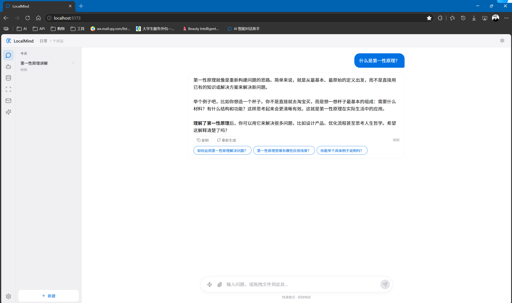
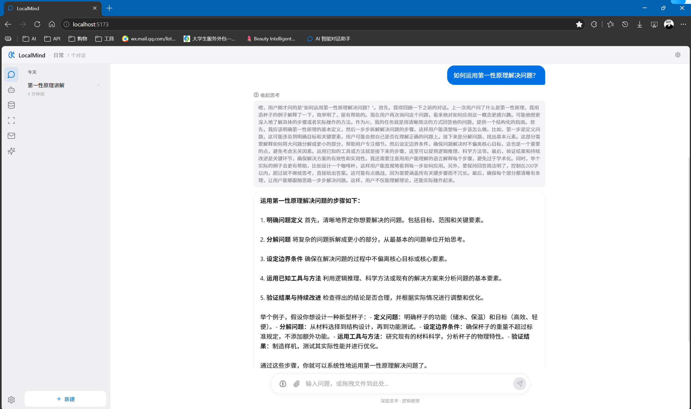
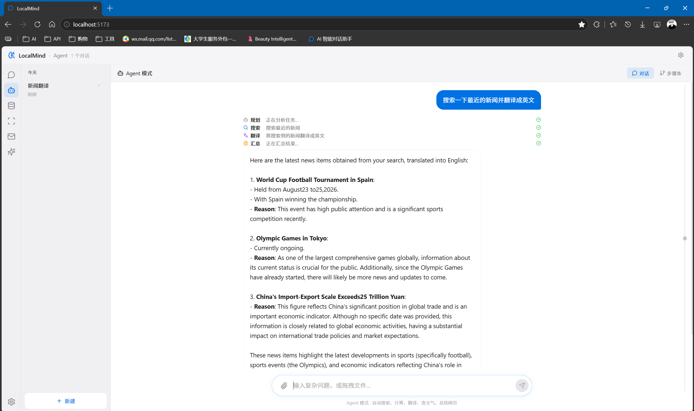
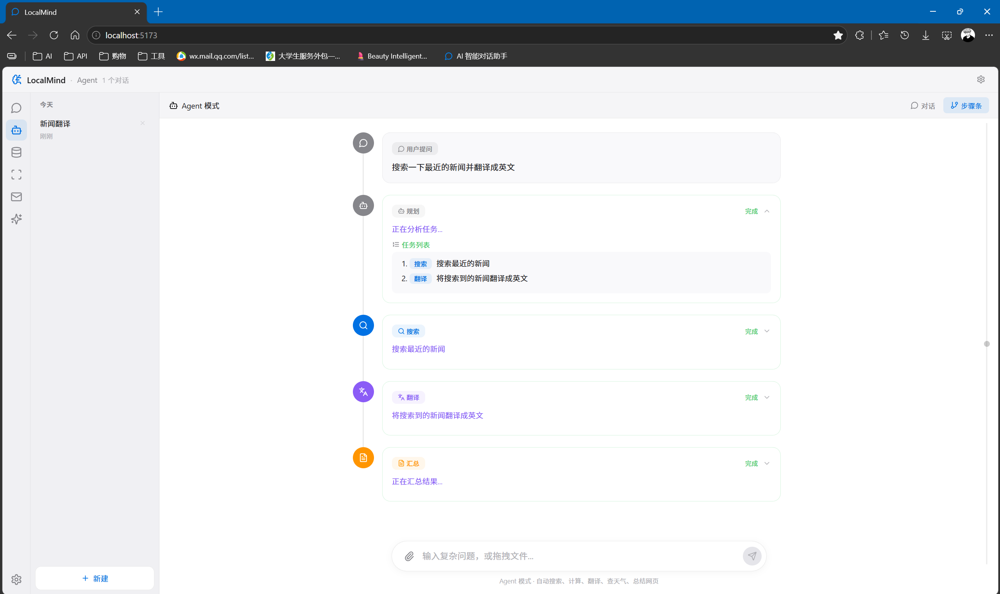
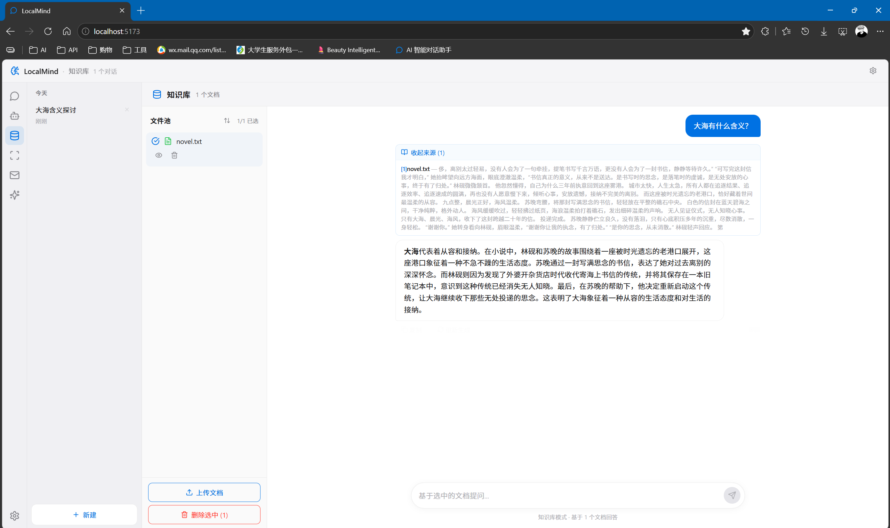
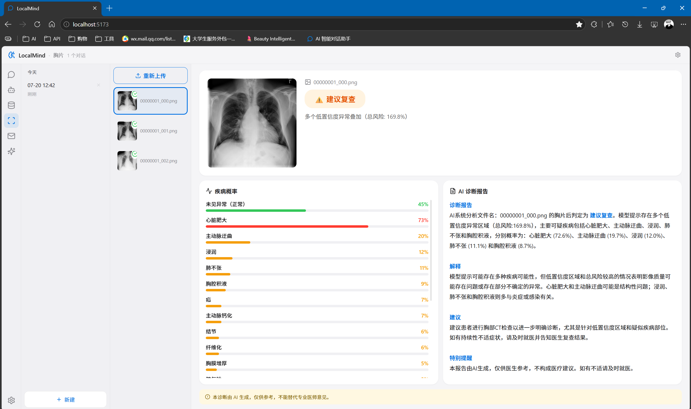
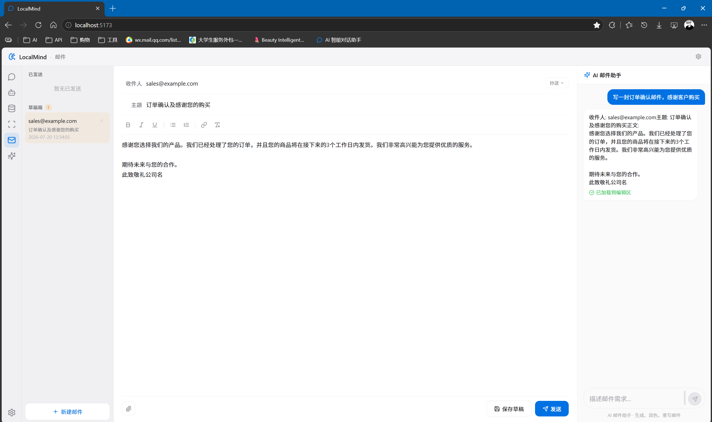

# LocalMind Agent

本地 AI 智能工作台 —— 基于 Ollama + FastAPI + Vue 3 构建的全栈 AI 桌面应用。

集成 5 个本地大模型，覆盖**日常对话、多 Agent 协作、知识库 RAG、胸片 AI 诊断、邮件生成**五大业务场景。

---

## 快速开始

### 方式一：Docker 部署（推荐）

无需安装任何环境，只要电脑有 Docker Desktop。

```bash
git clone https://github.com/Ljcjhfhjgd/localmind-agent.git
cd localmind-agent
docker-compose up -d
浏览器打开 http://localhost，在设置面板输入 API Key 即可使用。

方式二：本地开发
环境要求： Python 3.10+、Node.js 18+、Ollama

bash
# 1. 克隆项目
git clone https://github.com/Ljcjhfhjgd/localmind-agent.git
cd localmind-agent

# 2. 安装后端依赖
pip install -r requirements.txt

# 3. 安装前端依赖
cd frontend && npm install && cd ..

# 4. 安装 Ollama 并拉取模型
ollama pull qwen2.5:3b-instruct
ollama pull qwen2.5:7b-instruct
ollama pull deepseek-r1:7b
ollama pull minicpm-v:latest
ollama pull qwen3:4b-instruct

# 5. 一键启动
python start.py

# 6. 浏览器访问
http://localhost:8765/ui
API Key 说明
本项目内置 API Key 用于身份验证。

默认 API Key： LM01-7Qk3-mP2x-9Nf5

首次使用时，在设置面板的"通用"标签页中输入此 Key 即可。

如需修改，编辑 server/app.py 中的 API_KEY 变量。

邮件功能配置
邮件发送使用 QQ 邮箱 SMTP。

打开 QQ 邮箱 → 设置 → 账户 → POP3/SMTP 服务

开启 IMAP/SMTP 服务，生成授权码

在设置面板填入你的 QQ 邮箱地址和授权码

点击"发送测试邮件"验证配置

胸片诊断模型
模型文件较大（1GB+），未包含在代码仓库中。

请从以下链接下载三个文件，放入 tools/xray/xray_models/ 目录：

best_classifier.enc — ResNet50 疾病分类模型（125MB）

best_model.enc — 对比学习 OOD 检测模型（648MB）

contrastive_ood_stats.json — OOD 统计量

下载链接：百度网盘
链接: https://pan.baidu.com/s/1i3ARhI-u-aKK9gtBsI6GmQ?pwd=n8bn 提取码: n8bn

放入后重启项目，胸片诊断功能即可使用。

五大模式
1. 日常模式
流式对话 + 文件/图片上传。支持 Ctrl+V 粘贴图片、拖拽上传、快速/深度思考切换。图片会先经过视觉模型描述再生成回复。





2. Agent 模式（核心模块）
自研的多 Agent 协作引擎。采用 Master-Worker 架构：

Master Agent 负责分析用户意图，将复杂任务拆解为子任务 JSON

7 个 Worker 各司其职：搜索、代码生成与执行、代码审查、天气查询、翻译、时间、数学计算

子 Agent 间通过上下文传递实现链式协作

SSE 实时推送步骤状态（规划→执行→汇总），前端以步骤条 + 时间线双视图展示

支持文件上传，CodeAgent 可直接分析 CSV、图片等文件





3. 知识库 RAG
FAISS + BM25 混合检索，互补召回

bge-m3 文本嵌入，滑动窗口分块保证语义完整

LLM 自动评估检索质量，过滤低相关片段

回答标注引用来源，可点开查看原文

支持多文档联合问答，文件池管理



4. 胸片 AI 诊断
ResNet50 骨干 + 对比学习，在 ChestX-ray14（11 万张）上预训练

20 类胸部疾病分类，AUC 0.78

马氏距离 OOD 检测：不是胸片直接拒绝，防止误诊

视觉模型二次验证：minicpm-v 再次判断是否为胸片

按需生成 AI 诊断报告（疾病概率 + 通俗解释 + 专业建议）



MCP 服务（胸片诊断）
胸片诊断功能同时封装为 MCP Server，可供支持 MCP 协议的 AI 应用调用。

bash
python mcp/servers/xray_server.py
配置示例（Claude Desktop / Cursor 等）：

json
{
  "mcpServers": {
    "xray-diagnosis": {
      "command": "python",
      "args": ["mcp/servers/xray_server.py"]
    }
  }
}
5. 邮件模式
AI 起草/润色/重写邮件

QQ 邮箱 SMTP 发送

草稿箱 + 已发送管理

支持附件



技术栈
层	技术
前端	Vue 3 + Pinia + Vite + lucide-vue-next
后端	Python 3.10+ / FastAPI / asyncio
模型	Ollama（qwen2.5、deepseek-r1、minicpm-v 等 5 个）
向量库	FAISS + BM25 + bge-m3
存储	JSON 对话持久化 + ChromaDB
部署	Docker + Docker Compose
Ollama 配置
模型列表在 config.yaml 中配置，切换模型只需修改此文件：

yaml
ollama:
  base_url: http://localhost:11434
  mode_models:
    default: qwen2.5:7b-instruct
    fast: qwen2.5:3b-instruct
    reasoning: deepseek-r1:7b
    vision: minicpm-v:latest
    agent_planner: qwen3:4b-instruct
拉取模型命令：

bash
ollama pull qwen2.5:3b-instruct
ollama pull qwen2.5:7b-instruct
ollama pull deepseek-r1:7b
ollama pull minicpm-v:latest
ollama pull qwen3:4b-instruct
项目结构
text
localmind-agent/
├── agent/              # Agent 主类、对话管理、多 Agent 协作引擎
│   ├── core.py
│   ├── conversation.py
│   └── orchestrator/
├── server/             # FastAPI 入口、路由、中间件
├── frontend/           # Vue 3 + Pinia 前端
├── tools/              # 工具：搜索、代码执行、天气、翻译等
├── llm/                # Ollama API 封装
├── config.yaml
├── start.py
├── Dockerfile
└── docker-compose.yml